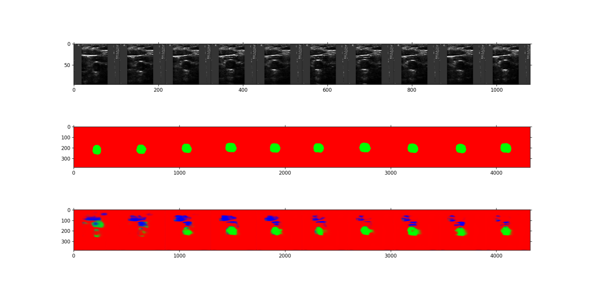

# ConvLSTM
Implementation of a Convolutional LSTM with Keras for video segmentation.

Data should be provided in separate folder as a set of videos (mp4 format) and the corresponding segmentation mask with the suffix "_label" in the filename (before extension).

To train the model run script 

```
lstm_train_fcn.py 
```

It will load the data, compress the resolution by a factor a 4 - the shape of input should be 
(W,D,C), respectively (96,108,1). Here I'm considering only 1 channel, i.e., black and white images.
For colour images change the shape.

Training should take 1 hour per video sequence of 1000 frames in an NVIDIA TitanX	

Example of image segmentation (top) with LSTM time (middle) and only convulutions (top)

